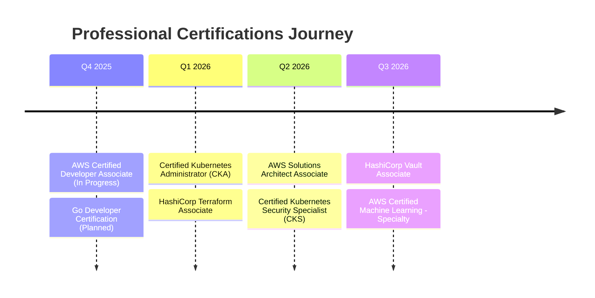

<h1 align="center">Emanuel Lázaro | T-Shaped Full Stack Software Engineer</h1>

## 🎯 Professional Summary

I am a **T-shaped Full Stack Software Engineer** with a deep specialization in **Go backend development, cloud-native systems, and DevSecOps**. As a Software Engineering student (2025-2029), I architect and build the secure, scalable, and automated infrastructure that powers modern web applications. My broad expertise across the full stack, including frontend development and MLOps, allows me to design and deliver cohesive, end-to-end solutions while maintaining a primary focus on backend excellence.

> *"I build the robust backend systems that form the core of an application, with the full-stack perspective needed to ensure it all works together seamlessly."*

## 🚀 My T-Shaped Profile

My skill set is structured like a "T": deep, specialized knowledge in a few core areas, supported by a broad base of experience across the web technology landscape.

### The Deep Dive (Vertical Bar of the T): Core Specialization
This is the foundation of my expertise, where I focus on building high-performance, secure, and scalable systems.

<table>
  <tr>
    <td valign="top" width="33.33%">
      <h3 align="center">🛡️ Backend & Systems Engineering</h3>
      

        Architecting high-throughput, concurrent, and resilient systems.
      

      

      

        <strong>Go:</strong> Designing highly concurrent systems using Goroutines, Channels, and advanced patterns for optimal performance and resource management.  
        <strong>Rust:</strong> Developing memory-safe, performance-critical components where security and efficiency are non-negotiable.  
        <strong>API Design:</strong> Building robust REST, gRPC, and GraphQL APIs with a contract-first approach (OpenAPI/Swagger).  
        <strong>Architecture:</strong> Implementing microservices, event-driven patterns (Kafka, RabbitMQ), and distributed systems principles.
      

    </td>
    <td valign="top" width="33.33%">
      <h3 align="center">☁️ Cloud & Platform Engineering</h3>
      

        Building and scaling automated infrastructure with a DevOps mindset.
      

      

      

        <strong>Cloud Native:</strong> Orchestrating applications with Kubernetes and deploying on multi-cloud environments (AWS, Azure, GCP).  
        <strong>Infrastructure as Code (IaC):</strong> Automating provisioning and management with Terraform for idempotent and repeatable infrastructure.  
        <strong>CI/CD Automation:</strong> Crafting secure and efficient pipelines with GitHub Actions for automated testing, security scanning, and deployment (Blue-Green, Canary).  
        <strong>Observability:</strong> Implementing comprehensive monitoring (Prometheus, Grafana) and distributed tracing (Jaeger) to minimize MTTR and maximize SLOs.
      

    </td>
    <td valign="top" width="33.33%">
      <h3 align="center">🔒 DevSecOps & System Security</h3>
      

        Integrating security into every phase of the development lifecycle.
      

      

      

        <strong>Shift-Left Security:</strong> Integrating SAST, DAST, and SCA scanning directly into CI/CD pipelines to identify vulnerabilities early.  
        <strong>Infrastructure Security:</strong> Hardening containers, Kubernetes clusters, and cloud environments. Managing secrets with tools like HashiCorp Vault.  
        <strong>Security as Code:</strong> Automating security controls and compliance policies for IaC (Terraform) and Kubernetes.  
        <strong>Zero-Trust Principles:</strong> Designing systems based on least-privilege access, network segmentation, and strong identity verification.
      

    </td>
  </tr>
</table>

### The Broad Foundation (Horizontal Bar of the T): Full-Stack Capabilities
This is my breadth of knowledge, enabling me to contribute across the stack and build complete, well-integrated products.

<table>
  <tr>
    <td valign="top" width="50%">
      <h3 align="center">🌐 Frontend Development</h3>
      

        Building modern, performant, and type-safe user interfaces.
      

      

      

        <strong>React & Next.js:</strong> Developing dynamic and server-rendered applications with React 18+ and Next.js 14+ (App Router).  
        <strong>TypeScript:</strong> Ensuring code quality, maintainability, and developer experience with end-to-end type safety.  
        <strong>Modern Tooling:</strong> Utilizing state management (Zustand), data fetching (React Query), and rapid styling (Tailwind CSS).
      

    </td>
    <td valign="top" width="50%">
      <h3 align="center">🤖 AI/ML & MLOps</h3>
      

        Applying backend principles to operationalize machine learning.
      

      

      

        <strong>Model Serving:</strong> Building scalable, low-latency APIs in Go or Python (FastAPI) to serve model inferences in production.  
        <strong>MLOps Pipelines:</strong> Automating the ML lifecycle (training, versioning, deployment) using tools like Kubeflow and MLflow.  
        <strong>Infrastructure for ML:</strong> Provisioning and managing the underlying cloud infrastructure required for ML workloads.
      

    </td>
  </tr>
</table>

## 🛠️ Technology & Tools

### Primary Tech Stack
<table>
  <tr>
    <td width="25%"><strong>Languages & Runtimes</strong></td>
    <td>
      
      
      
      
      
      
    </td>
  </tr>
  <tr>
    <td><strong>Frontend</strong></td>
    <td>
      
      
      
    </td>
  </tr>
  <tr>
    <td><strong>Cloud & Orchestration</strong></td>
    <td>
      
      
      
      
      
    </td>
  </tr>
  <tr>
    <td><strong>Infrastructure & CI/CD</strong></td>
    <td>
      
      
      
      
    </td>
  </tr>
  <tr>
    <td><strong>Databases & Messaging</strong></td>
    <td>
      
      
      
      
    </td>
  </tr>
  <tr>
    <td><strong>Observability & Security</strong></td>
    <td>
      
      
      
      
    </td>
  </tr>
</table>

### Supplemental AI/ML Toolchain
<table>
  <tr>
    <td width="25%"><strong>Frameworks & Libraries</strong></td>
    <td>
      
      
      
      
    </td>
  </tr>
  <tr>
    <td><strong>MLOps & Data</strong></td>
    <td>
      
      
      
      
    </td>
  </tr>
</table>

## 📈 GitHub Analytics & Activity

  
  
   
  

## 🎓 Learning & Professional Growth

### 📚 Current Focus Areas (Q4 2025)
- **🔬 Advanced Go Patterns**: Mastering generics, memory optimization, and advanced concurrency for high-performance services.
- **☁️ Cloud Native Security**: Mastering zero-trust architectures, service mesh security (Istio), and runtime security with eBPF.
- **📊 Distributed Systems**: Exploring event sourcing, CQRS, and achieving eventual consistency in complex systems.
- **🌐 Modern Frontend**: Deepening expertise in WebAssembly (WASM) and advanced Next.js patterns.

### 🏆 Certification Roadmap

## 🤝 Let's Connect & Collaborate!

I am actively seeking opportunities in **Backend, Platform, DevOps, and DevSecOps Engineering** roles where I can contribute my deep systems knowledge while leveraging my full-stack perspective.

### 💡 Open for Collaboration On:
- **🚀 High-performance Go applications** and distributed systems
- **☁️ Cloud infrastructure automation** and platform engineering
- **🔒 Implementing DevSecOps practices** and security automation
- **📖 Open source projects** focused on cloud-native tooling

### 📬 Get In Touch:

---

  <i>"Building the infrastructure that powers tomorrow's applications, one commit at a time."</i>

