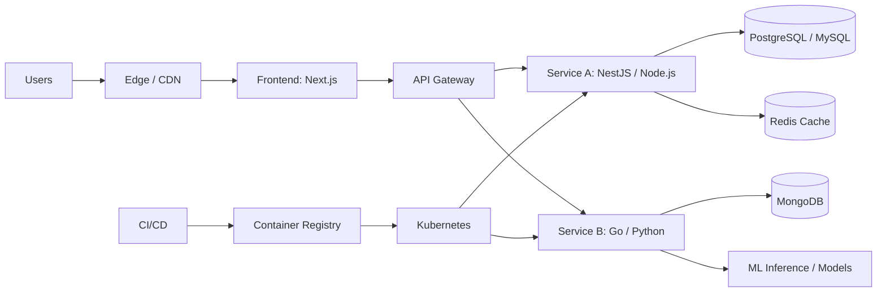

<div align="center">


[;Python+%26+Go;Cloud+%7C+DevOps+%7C+Databases+%7C+AI%2FML)](https://git.io/typing-svg)

<p align="center">
  <a href="https://emanuellcs.vercel.app"></a>
  <a href="https://linkedin.com/in/emanuellcs"></a>
  <a href="https://www.kaggle.com/emanuellcs"></a>
  <a href="https://huggingface.co/emanuellcs"></a>
  <a href="mailto:emanuellzr01@outlook.com"></a>
  <a href="https://gitlab.com/emanuellcs"></a>
</p>


</div>

## 👨‍💻 About

Software Engineering & Computer Science student (2025–2029) focused on high-performance Full Stack development. I work with an engineering vision, combining modern interfaces with robust backends, guided by Clean Architecture, Domain-Driven Design (DDD), and SOLID.

My main stack is the TypeScript ecosystem (Node.js, React, Next.js, NestJS), with Python and Go used strategically for automation, data workflows, and concurrency-critical services. I am actively pursuing internship opportunities where I can apply modern web development, cloud-native delivery, and applied AI/ML to real-world systems.

```ts
const profile = {
  title: "Software Engineering Student",
  specialization: "Full Stack Development",
  stack:
    "TypeScript (Node.js, React, Next.js, NestJS) | Python & Go | Cloud, DevOps, Databases & AI/ML",

  education: {
    field: "Software Engineering & Computer Science",
    period: "2025–2029",
  },

  coreFocus: [
    "Scalable and High-Performance Web Systems",
    "Cloud-Native Architecture and Delivery",
    "AI/ML Integration in Production Systems",
  ],

  engineeringPrinciples: [
    "Clean Architecture",
    "Domain-Driven Design (DDD)",
    "SOLID Principles",
  ],
};
```


### What I do
- Full Stack delivery with production-grade ergonomics: performance, security, and maintainability.
- API design and backend systems: REST/GraphQL, microservices patterns, messaging, and WebSockets.
- Cloud & DevOps: containerization, CI/CD pipelines, and cloud deployment workflows.
- Data: relational and NoSQL modeling, query optimization, and caching strategies.
- AI/ML: model training and integration patterns for intelligent features in web systems.

<br clear="right"/>

---

## 🧭 Competency Pillars

<div align="center">

<table>
  <tr>
    <td align="center" width="33%">
      
      <br/><b>Full Stack Systems</b>
      <br/><sub>React, Next.js, Node.js, NestJS</sub>
    </td>
    <td align="center" width="33%">
      
      <br/><b>Cloud & DevOps</b>
      <br/><sub>Docker, Kubernetes, CI/CD, AWS</sub>
    </td>
    <td align="center" width="33%">
      
      <br/><b>AI/ML Integration</b>
      <br/><sub>Python, Deep Learning, Kaggle</sub>
    </td>
  </tr>
</table>

</div>

---

## 🛠️ Tech Stack

<div align="center">

### 💻 Languages


### 🎨 Frontend


### ⚙️ Backend & APIs


### ☁️ Cloud & DevOps


### 💾 Databases & Caching


### 🤖 AI/ML & Data


</div>

### Stack summary
| Domain | Primary focus | Notes |
|---|---|---|
| Frontend | React, Next.js (SSR/ISR), TypeScript | Accessible UI, performance, web fundamentals |
| Backend | Node.js, NestJS, REST/GraphQL | Microservices patterns, WebSockets, security |
| Cloud & DevOps | Docker, Kubernetes, CI/CD, AWS | Cloud delivery mindset; familiarity with Azure/GCP |
| Data | PostgreSQL, MySQL, MongoDB, Redis | Efficient modeling, indexing, query optimization |
| AI/ML | PyTorch, TensorFlow, Hugging Face | Kaggle-driven experimentation and integration |

---

## 🧱 Architecture & Engineering Practices

I optimize for reliability and long-term maintainability by applying proven principles and patterns:
- Clean Architecture: explicit boundaries, testable business rules, infrastructure adapters.
- DDD: ubiquitous language, domain modeling, and clear separation of concerns.
- SOLID: small units with cohesive responsibilities and stable contracts.
- System design: decomposition, backpressure, caching, and failure-aware design.

### Reference architecture



<details>
  <summary><b>Engineering checklist</b> (quality, security, performance)</summary>

- API design: versioning strategy, validation, rate limiting, and observability.
- Performance: profiling, caching, indexing, and pragmatic trade-offs.
- Security: least privilege, secrets hygiene, OWASP basics, and secure defaults.
- Delivery: CI/CD automation, containerized runtimes, reproducible environments.

</details>

---

## 🧠 AI/ML & Data Science

Machine Learning & Data Science competitor on Kaggle. I use competitions to benchmark models, refine feature engineering, and stress-test applied ML workflows.

**Technical focus**
- Training Deep Learning models with PyTorch/TensorFlow.
- Mathematical foundations for optimization and regularization (linear algebra, multivariable calculus, probability/statistics).
- Feature engineering and large-scale data processing.
- Computer Vision and NLP for unstructured problems.
- Continuous study of SOTA architectures and modern training techniques.

---

## 📊 GitHub Statistics

<div align="center">
  
  
</div>

<div align="center">
  
</div>

---

## 💼 Open To

<div align="center">

| Position | Focus areas | Goal |
|---|---|---|
| Internship / Junior | Full Stack, Backend, Cloud | Apply engineering fundamentals in production contexts |
| Collaboration | High-impact systems | Deliver scalable, maintainable code |

</div>

---

## 📫 Contact

<div align="center">

<a href="https://emanuellcs.vercel.app">
  
</a>
<a href="https://linkedin.com/in/emanuellcs">
  
</a>
<a href="mailto:emanuellzr01@outlook.com">
  
</a>
<a href="https://huggingface.co/emanuellcs">
  
</a>

</div>

<div align="center">

<b>Building scalable systems with clean interfaces, robust backends, and measurable outcomes.</b>


</div>
