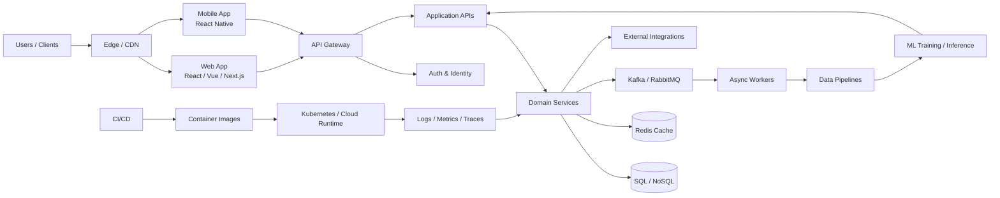
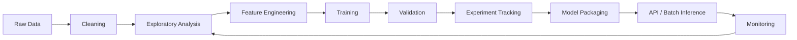

<div align="center">


[](https://git.io/typing-svg)

<br />

<a href="https://emanuellcs.vercel.app" target="_blank">
  
</a>
<a href="https://linkedin.com/in/emanuellcs" target="_blank">
  
</a>
<a href="https://www.kaggle.com/emanuellcs" target="_blank">
  
</a>
<a href="https://huggingface.co/emanuellcs" target="_blank">
  
</a>
<a href="https://gitlab.com/emanuellcs" target="_blank">
  
</a>
<a href="mailto:emanuellzr01@outlook.com">
  
</a>

<br /><br />


</div>

<br />

<table>
  <tr>
    <td width="62%" valign="top">

## `whoami`

I am **Emanuel Lázaro**, a **Full-Stack Software Engineer**, **Data Scientist**, and **AI/ML Engineer** based in **Ceará, Brazil**.

I design and implement software across the full product lifecycle: user interfaces, backend services, API platforms, data workflows, cloud infrastructure, and applied machine learning systems. My current academic path combines **Software Engineering** and **Computer Science** studies from **2025 to 2029**, with a strong focus on production-grade engineering practices.

GitHub is my public engineering workspace: a place for full-stack applications, backend architecture, data science work, ML experiments, infrastructure patterns, technical studies, and long-term learning.

</td>
<td width="38%" valign="top">

## Command Center

| Area | Current Direction |
|---|---|
| **Core Role** | Full-Stack Software Engineering |
| **Secondary Axis** | Data Science · AI/ML Engineering |
| **Primary Output** | Reliable products, APIs, and data-driven systems |
| **Engineering Style** | Clean boundaries, explicit contracts, measurable quality |
| **Career Status** | Internship and junior engineering opportunities |
| **Location** | Ceará, Brazil 🇧🇷 |

</td>
</tr>
</table>

<br />

<div align="center">

## Engineering Compass

</div>

<table>
  <tr>
    <td align="center" width="25%">
      
      <br /><br />
      Interfaces, dashboards, authenticated applications, server-side rendering, mobile clients, and product-oriented UX flows.
    </td>
    <td align="center" width="25%">
      
      <br /><br />
      APIs, service layers, domain modeling, authentication, messaging, caching, observability, and integration boundaries.
    </td>
    <td align="center" width="25%">
      
      <br /><br />
      Data cleaning, feature engineering, model experimentation, notebooks, applied machine learning, NLP, and computer vision.
    </td>
    <td align="center" width="25%">
      
      <br /><br />
      Containers, CI/CD, infrastructure automation, cloud services, deployment pipelines, monitoring, and runtime resilience.
    </td>
  </tr>
</table>

---

<div align="center">

## Technology Galaxy


<br /><br />

</div>

<table>
  <tr>
    <td width="50%" valign="top">

### Frontend, Mobile & Interface Engineering

<p>
  
  
  
  
  
  
  
  
</p>

- Component-driven interfaces with reusable UI patterns.
- SPA, SSR, routing, forms, state management, and API integration.
- Responsive layouts, accessibility-aware structure, and modern frontend tooling.
- Mobile-oriented application development with **React Native**.

</td>
<td width="50%" valign="top">

### Backend, APIs & Service Architecture

<p>
  
  
  
  
  
  
  
  
  
</p>

- REST, GraphQL, gRPC, WebSocket, and event-oriented backends.
- Authentication, authorization, validation, error contracts, and versioned APIs.
- Modular service layers with domain-first boundaries and testable units.
- Frameworks treated as delivery mechanisms, not the center of the architecture.

</td>
</tr>
<tr>
<td width="50%" valign="top">

### Data, AI/ML & Analytical Workflows

<p>
  
  
  
  
  
  
  
  
</p>

- Exploratory data analysis, preprocessing, and feature engineering.
- Deep learning experimentation with PyTorch and TensorFlow.
- NLP and computer vision fundamentals with deployment-oriented thinking.
- Reproducible notebooks, clear metrics, and explainable model evaluation.

</td>
<td width="50%" valign="top">

### Cloud, DevOps & Platform Engineering

<p>
  
  
  
  
  
  
  
  
</p>

- Containerized applications, reproducible environments, and deployment automation.
- CI/CD pipelines with checks for formatting, tests, builds, and releases.
- Infrastructure as code, environment configuration, and cloud-native runtime patterns.
- Runtime monitoring, health checks, rollback paths, and operational discipline.

</td>
</tr>
</table>

---

<div align="center">

## Technical Domain Matrix

</div>

| Domain | Problems I Work On | Technologies & Practices |
|---|---|---|
| **Frontend Engineering** | Product interfaces, dashboards, responsive applications, UI architecture | React, React Native, Vue, Next.js, TypeScript, Tailwind CSS, Vite |
| **Backend Engineering** | APIs, service layers, authentication, domain workflows, integrations | Node.js, NestJS, Spring Boot, FastAPI, Go, REST, GraphQL, gRPC |
| **Distributed Systems** | Messaging, caching, async workflows, resilience, service boundaries | Kafka, RabbitMQ, Redis, Docker, Kubernetes, observability concepts |
| **Data Engineering** | Data cleaning, analytical pipelines, feature workflows, SQL modeling | Python, Pandas, NumPy, PostgreSQL, MySQL, MongoDB, notebooks |
| **Machine Learning** | Model experimentation, CV/NLP foundations, training/evaluation loops | PyTorch, TensorFlow, scikit-learn, Hugging Face, Kaggle |
| **Cloud & DevOps** | CI/CD, container orchestration, infrastructure automation, runtime reliability | AWS, Azure, GCP, Terraform, GitHub Actions, Nginx |
| **Systems Exploration** | Memory, concurrency, rendering, game-engine concepts, low-level design | C, C++, C#, Rust, WebGL, WebGPU, WGSL, Three.js |

---

<div align="center">

## System Design Blueprint

</div>


```mermaid
flowchart LR
  U[Users / Clients] --> EDGE[Edge / CDN]
  EDGE --> WEB[Web App\nReact / Vue / Next.js]
  EDGE --> MOB[Mobile App\nReact Native]

  WEB --> GW[API Gateway]
  MOB --> GW

  GW --> AUTH[Auth & Identity]
  GW --> API[Application APIs]
  API --> DOM[Domain Services]
  DOM --> DB[(SQL / NoSQL)]
  DOM --> CACHE[(Redis Cache)]
  DOM --> MQ[Kafka / RabbitMQ]
  DOM --> EXT[External Integrations]

  MQ --> WORKERS[Async Workers]
  WORKERS --> DATA[Data Pipelines]
  DATA --> ML[ML Training / Inference]
  ML --> API

  CI[CI/CD] --> IMG[Container Images]
  IMG --> K8S[Kubernetes / Cloud Runtime]
  K8S --> OBS[Logs / Metrics / Traces]
  OBS --> DOM
```

<table>
  <tr>
    <td width="33%" valign="top">

### Architecture Priorities

- Explicit domain boundaries.
- Independent, testable application services.
- Stable API contracts and predictable error responses.
- Framework-agnostic core logic where practical.

</td>
<td width="33%" valign="top">

### Reliability Priorities

- Structured logs and meaningful metrics.
- Timeouts, retries, and failure-aware integrations.
- Queues for long-running or decoupled workflows.
- Caching with clear consistency assumptions.

</td>
<td width="33%" valign="top">

### Delivery Priorities

- Automated checks before deployment.
- Reproducible local and production environments.
- Secure configuration and secret isolation.
- Rollback-aware release strategy.

</td>
</tr>
</table>

---

<div align="center">

## AI/ML Workflow Map

</div>


```mermaid
flowchart LR
  A[Raw Data] --> B[Cleaning]
  B --> C[Exploratory Analysis]
  C --> D[Feature Engineering]
  D --> E[Training]
  E --> F[Validation]
  F --> G[Experiment Tracking]
  G --> H[Model Packaging]
  H --> I[API / Batch Inference]
  I --> J[Monitoring]
  J --> C
```

<table>
  <tr>
    <td width="25%" align="center"><strong>Data Quality</strong><br />Missing values, leakage checks, distributions, reproducibility.</td>
    <td width="25%" align="center"><strong>Modeling</strong><br />Classical ML, deep learning, NLP, CV, metric-driven iteration.</td>
    <td width="25%" align="center"><strong>Evaluation</strong><br />Validation strategy, baselines, error analysis, explainability.</td>
    <td width="25%" align="center"><strong>Deployment Thinking</strong><br />Inference latency, API shape, batching, monitoring, drift awareness.</td>
  </tr>
</table>

---

<div align="center">

## Engineering Operating System

</div>

<table>
  <tr>
    <td width="50%" valign="top">

### Build

- Convert requirements into explicit domain models and workflows.
- Prefer readable modules over clever abstractions.
- Design APIs with clear contracts, validation, and failure semantics.
- Keep transport, persistence, and framework concerns isolated from business logic.

</td>
<td width="50%" valign="top">

### Validate

- Test critical behavior, edge cases, and integration boundaries.
- Profile before optimizing.
- Review security assumptions early: inputs, auth, authorization, and secrets.
- Define success metrics before declaring a system complete.

</td>
</tr>
<tr>
<td width="50%" valign="top">

### Scale

- Add caching deliberately, with invalidation and consistency in mind.
- Use queues and streams for decoupling and long-running workloads.
- Keep service boundaries justified by ownership, deployment, and domain cohesion.
- Monitor latency, throughput, saturation, error rates, and resource pressure.

</td>
<td width="50%" valign="top">

### Deliver

- Automate formatting, linting, tests, builds, and deployments.
- Containerize applications for consistent environments.
- Keep configuration environment-aware and secrets outside the codebase.
- Document operational decisions for future maintainers.

</td>
</tr>
</table>

---

<div align="center">

## Current Learning & Execution Tracks

</div>

<table>
  <tr>
    <td align="center" width="20%">
      
      <br /><br />
      APIs, service design, domain modeling, messaging, auth, and observability.
    </td>
    <td align="center" width="20%">
      
      <br /><br />
      React, Vue, Next.js, React Native, component architecture, and modern UI systems.
    </td>
    <td align="center" width="20%">
      
      <br /><br />
      Kaggle workflows, PyTorch, TensorFlow, Hugging Face, NLP, CV, and evaluation.
    </td>
    <td align="center" width="20%">
      
      <br /><br />
      Docker, Kubernetes, Terraform, cloud platforms, CI/CD, and deployment reliability.
    </td>
    <td align="center" width="20%">
      
      <br /><br />
      Rust, C++, WebGPU, rendering concepts, concurrency, memory, and engine architecture.
    </td>
  </tr>
</table>

---

<div align="center">

## GitHub Analytics


<br /><br />


<br /><br />


<br /><br />


</div>

---

<details>
  <summary><strong>Engineering principles and quality checklist</strong></summary>

<br />

| Principle | Application |
|---|---|
| **Clean Architecture** | Business rules remain independent from frameworks, persistence, and transport details. |
| **Domain-Driven Design** | The codebase reflects the problem domain through explicit language, bounded contexts, and useful abstractions. |
| **SOLID Design** | Modules stay cohesive, dependencies stay controlled, and contracts stay explicit. |
| **Testing Discipline** | Domain behavior, critical workflows, and integration boundaries receive automated coverage. |
| **Security Awareness** | Inputs, authentication, authorization, secrets, and privileges are treated as design concerns. |
| **Operational Thinking** | Logs, metrics, traces, health checks, latency, and failure modes are considered from the beginning. |

<br />

| Area | Checklist |
|---|---|
| **API Design** | Versioning, validation, pagination, idempotency, consistent response format, useful error models. |
| **Data Modeling** | Entity boundaries, normalization where useful, indexing strategy, migration safety, transaction scope. |
| **Security** | AuthN/AuthZ, secret management, least privilege, input validation, dependency awareness. |
| **Performance** | Profiling, caching, query optimization, asynchronous processing, resource limits. |
| **Reliability** | Retries, timeouts, circuit breakers, queue durability, graceful degradation. |
| **Delivery** | CI/CD, reproducible builds, rollback strategy, release notes, environment configuration. |

</details>

<details>
  <summary><strong>Professional profile in code</strong></summary>

```typescript
type EngineeringDomain =
  | "frontend"
  | "mobile"
  | "backend"
  | "data"
  | "ai_ml"
  | "cloud"
  | "systems";

const emanuel = {
  name: "Emanuel Lázaro",
  location: "Ceará, Brazil",
  role: ["Full-Stack Software Engineer", "Data Scientist", "AI/ML Engineer"],
  education: "Software Engineering + Computer Science, 2025–2029",
  openTo: ["Internship", "Junior Engineering", "Open Source Collaboration"],
  domains: [
    "frontend",
    "mobile",
    "backend",
    "data",
    "ai_ml",
    "cloud",
    "systems",
  ] satisfies EngineeringDomain[],
  values: [
    "clear architecture",
    "maintainable code",
    "observable systems",
    "secure delivery",
    "continuous learning",
  ],
};
```

</details>

<details>
  <summary><strong>Systems and low-level exploration</strong></summary>

<br />

Although my main professional direction is full-stack, backend, data, cloud, and AI/ML engineering, I also study lower-level computing topics as a way to understand performance, runtime behavior, and system internals.

| Area | Focus |
|---|---|
| **C / C++ / Rust** | Memory models, ownership, concurrency, performance, and systems-level problem solving. |
| **C#** | Application architecture, tooling, and game-development-oriented experimentation. |
| **WebGL / WebGPU / WGSL** | Real-time rendering concepts, GPU pipelines, shaders, and graphics programming fundamentals. |
| **Game Engine Concepts** | ECS patterns, rendering loops, asset handling, simulation, and engine architecture. |

</details>

---

<div align="center">

## Collaboration Surface

</div>

<table>
  <tr>
    <td width="33%" align="center">
      <h3>Internship / Junior Roles</h3>
      <p>Full-stack, backend, cloud, data, and AI/ML engineering opportunities.</p>
    </td>
    <td width="33%" align="center">
      <h3>Open Source</h3>
      <p>Developer tooling, backend systems, learning resources, automation, and ML projects.</p>
    </td>
    <td width="33%" align="center">
      <h3>Technical Growth</h3>
      <p>System design, distributed architectures, cloud platforms, applied AI, and production-grade engineering.</p>
    </td>
  </tr>
</table>

<div align="center">

<a href="https://emanuellcs.vercel.app" target="_blank">
  
</a>
<a href="https://linkedin.com/in/emanuellcs" target="_blank">
  
</a>
<a href="mailto:emanuellzr01@outlook.com">
  
</a>

<br /><br />

<picture>
  <source media="(prefers-color-scheme: dark)" srcset="https://raw.githubusercontent.com/platane/snk/output/github-contribution-grid-snake-dark.svg" />
  <source media="(prefers-color-scheme: light)" srcset="https://raw.githubusercontent.com/platane/snk/output/github-contribution-grid-snake.svg" />
  
</picture>

<br /><br />

<strong>Building reliable software with clean interfaces, resilient infrastructure, and measurable engineering outcomes.</strong>

<br /><br />


</div>
