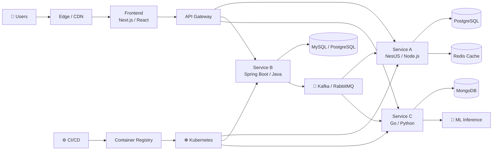

<div align="center">


[.;Database+specialist+(SQL,+NoSQL,+Redis).;AI%2FML+practitioner+(PyTorch,+TensorFlow).;Systems+%26+Low-Level+enthusiast+(Rust,+C%2B%2B,+C).;Building+scalable,+distributed+architectures.;Crafting+high-performance+REST+%26+gRPC+APIs.;Passionate+about+observability+and+system+resilience.;Exploring+the+bleeding+edge+of+web+technologies.)](https://git.io/typing-svg)

<br/>

<p align="center">
  <a href="https://emanuellcs.vercel.app" target="_blank">
    
  </a>
  &nbsp;
  <a href="https://linkedin.com/in/emanuellcs" target="_blank">
    
  </a>
  &nbsp;
  <a href="https://www.kaggle.com/emanuellcs" target="_blank">
    
  </a>
  &nbsp;
  <a href="https://huggingface.co/emanuellcs" target="_blank">
    
  </a>
  &nbsp;
  <a href="https://gitlab.com/emanuellcs" target="_blank">
    
  </a>
  &nbsp;
  <a href="mailto:emanuellzr01@outlook.com">
    
  </a>
</p>


</div>

<br/>

<div align="center">

## 👨‍💻 About Me

</div>


I am a **Software Engineering & Computer Science** double-degree student **(2025–2029)** based in Brazil, building production-grade systems across the full stack with an engineering-first mindset.

My primary ecosystems are:

- **TypeScript:** Node.js, React, Next.js, NestJS — modern web and APIs
- **Java:** Spring Boot, Spring Cloud, JPA/Hibernate — enterprise backends
- **Python & Go:** data workflows, ML, automation, and concurrency-critical services

Beyond my professional focus, I am a passionate hobbyist in **low-level systems and game engine development** using **C, C++, C#, and Rust** — exploring memory management, concurrency primitives, and real-time rendering with **WebGL, WebGPU, and WGSL**.

I actively compete on **Kaggle**, publish models on **Hugging Face**, and pursue certifications in cloud-native technologies. Currently seeking **internship** and **junior engineering** opportunities to contribute to real systems and grow inside strong engineering teams.

<br clear="right"/>

```typescript
const emanuellcs = {
  name     : "Emanuel Lázaro",
  pronouns : "he/him",
  location : "Mucambo, Ceará, Brazil 🇧🇷",
  education: "Software Engineering & Computer Science (2025–2029)",

  github: {
    purpose : "Central hub for everything I build",
    contains: [
      "Production-grade full-stack applications",
      "Enterprise Java / Spring Boot backends",
      "Cloud-native & DevOps infrastructure",
      "AI/ML experiments & Kaggle workflows",
      "Low-level systems, game engines (C, C++, C#, Rust) & Real-time rendering (WebGPU/WGSL)",
    ],
  },

  gitlab: {
    purpose : "External open-source contributions & community initiatives",
    contains: [
      "Contributions to third-party open-source projects",
      "Community-driven collaborative work",
    ],
  },

  stacks: {
    typescript : ["Node.js", "NestJS", "React", "Next.js", "Express.js"],
    java       : ["Spring Boot", "Spring Cloud", "Hibernate/JPA", "Spring Security"],
    python     : ["FastAPI", "PyTorch", "TensorFlow", "Pandas", "NumPy"],
    go         : ["Gin", "gRPC", "Concurrency Patterns"],
    lowLevel   : ["C", "C++", "C#", "Rust"],
  },

  principles : ["Clean Architecture", "Domain-Driven Design", "SOLID", "TDD"],
  status     : "Open to Internship & Junior Engineering roles",
};
```

<br/>

<div align="center">

## 🏛️ Engineering Philosophy

</div>

I build software guided by a consistent set of principles that prioritize long-term correctness over short-term convenience.

**Clean Architecture** — every module has explicit boundaries, with business rules isolated from infrastructure and frameworks, keeping the core testable and framework-agnostic.

**Domain-Driven Design (DDD)** — ubiquitous language, bounded contexts, and rich domain models ensure that the code communicates intent and mirrors the business problem faithfully.

**SOLID** — cohesive, single-purpose units with stable, dependency-inverted contracts reduce coupling and make change safe and predictable.

**Test-Driven Development** — test-first thinking with JUnit 5 + Mockito (Java) and Jest/Vitest (TypeScript) ensures correctness is never an afterthought.

**Systems thinking** — failure modes, backpressure, caching strategy, and event-driven decomposition are first-class design concerns, not retrofit solutions.

### ⚙️ Engineering Checklist — Quality, Security & Delivery

**API Design**
- [x] Versioning strategy, input validation, standardized error contracts
- [x] Rate limiting, throttling, and observability via structured logging and distributed tracing

**Performance**
- [x] Profiling hot paths, pragmatic multi-layer caching, index optimization
- [x] Async processing via Kafka / RabbitMQ for long-running operations

**Security**
- [x] Least-privilege design; secrets managed via Vault or AWS Secrets Manager
- [x] OWASP Top 10 awareness; JWT/OAuth2 with Spring Security or Passport.js

**Delivery**
- [x] CI/CD via GitHub Actions; containerized runtimes; reproducible environments
- [x] Semantic versioning, rollback strategies, and Kubernetes health probes

<br/>

<div align="center">

## 🗺️ Reference Architecture

</div>


```mermaid
flowchart LR
  U[👤 Users] --> E[Edge / CDN]
  E --> FE[Frontend\nNext.js / React]
  FE --> GW[API Gateway]

  GW --> STS[Service A\nNestJS / Node.js]
  GW --> SJV[Service B\nSpring Boot / Java]
  GW --> SGO[Service C\nGo / Python]

  STS --> DB1[(PostgreSQL)]
  STS --> CA[(Redis Cache)]
  SJV --> DB2[(MySQL / PostgreSQL)]
  SJV --> MQ[📨 Kafka / RabbitMQ]
  SGO --> DB3[(MongoDB)]
  SGO --> ML[🤖 ML Inference]

  MQ --> STS
  MQ --> SGO

  CI[⚙️ CI/CD] --> REG[Container Registry]
  REG --> K8s[☸️ Kubernetes]
  K8s --> STS
  K8s --> SJV
  K8s --> SGO
```

<br/>

<div align="center">

## 🛠️ Full Tech Stack

### 💻 Languages


<br/>

### 🎨 Frontend Development


<br/>

### ☕ Java / Spring Ecosystem


<br/>

### ⚙️ Backend, APIs & Messaging


<br/>

### ☁️ Cloud, DevOps & Infrastructure


<br/>

### 💾 Databases & Caching


<br/>

### 🤖 AI / ML & Data Science


<br/>

### 🦀 Hobby: Low-Level & Game Engine Development


> Memory management, concurrency primitives, ECS patterns, and real-time rendering — explored as a passion outside my primary professional stack.

</div>

<br/>

<div align="center">

## 📋 Stack at a Glance

| Domain | Primary Technologies | Notes |
|:---|:---|:---|
| **Frontend** | React, Next.js (SSR/ISR/RSC), WebGL | TypeScript, Tailwind CSS, Three.js |
| **Backend (TS)** | NestJS, Express.js | REST, GraphQL, gRPC, WebSockets |
| **Backend (Java)** | Spring Boot, Spring Cloud | JPA/Hibernate, Spring Security, Maven/Gradle |
| **Messaging** | Apache Kafka, RabbitMQ | Event-driven, async workflows |
| **Cloud & DevOps** | AWS, Azure, GCP | Docker, Kubernetes, Terraform, CI/CD |
| **Databases** | PostgreSQL, MongoDB, Redis | Query optimization, caching, Elasticsearch |
| **AI/ML** | PyTorch, TensorFlow, Hugging Face | Computer Vision, NLP, Kaggle competitions |
| **Systems (Hobby)** | C, C++, C#, Rust | Game engines, renderers, low-level design |

<br/>

## ☕ Java & Spring Ecosystem — Deep Dive

</div>

<b>What I build with the Spring ecosystem</b>
<br/>

**Spring Boot**
- REST API development with layered architecture (Controller → Service → Repository)
- Dependency injection, auto-configuration, and profile-based environments
- Global exception handling with `@ControllerAdvice` and standardized error responses

**Spring Security**
- JWT-based stateless authentication and role-based access control (RBAC)
- OAuth2 integration and method-level security with `@PreAuthorize`

**Spring Data JPA / Hibernate**
- Entity modeling, complex relationships, and lifecycle management
- Custom JPQL / native queries, pagination, N+1 prevention, and query optimization

**Spring Cloud**
- Service discovery (Eureka), API Gateway (Spring Cloud Gateway)
- Circuit breaker patterns with Resilience4j
- Distributed configuration with Spring Cloud Config

**Testing**
- Unit tests with JUnit 5 + Mockito
- Integration tests with `@SpringBootTest` and Testcontainers

```java
@RestController
@RequestMapping("/api/v1/projects")
@RequiredArgsConstructor
public class ProjectController {

    private final ProjectService projectService;

    @GetMapping("/{id}")
    public ResponseEntity<ProjectDTO> findById(@PathVariable UUID id) {
        return ResponseEntity.ok(projectService.findById(id));
    }

    @PostMapping
    @PreAuthorize("hasRole('DEVELOPER')")
    public ResponseEntity<ProjectDTO> create(@Valid @RequestBody CreateProjectRequest request) {
        ProjectDTO created = projectService.create(request);
        URI location = ServletUriComponentsBuilder.fromCurrentRequest()
            .path("/{id}").buildAndExpand(created.id()).toUri();
        return ResponseEntity.created(location).body(created);
    }
}
```

<br/>

<div align="center">

## 🧠 AI / ML & Data Science

</div>

I compete on **Kaggle** to benchmark models, stress-test feature engineering pipelines, and validate applied ML workflows against real-world data distributions.

**Technical focus areas:**
- Training and fine-tuning Deep Learning models with **PyTorch** and **TensorFlow**
- Mathematical foundations: linear algebra, multivariable calculus, probability, and statistics
- Feature engineering and large-scale data processing with **Pandas** and **NumPy**
- **Computer Vision** and **NLP** for unstructured problem domains
- Fine-tuning and deploying models from **Hugging Face Hub**
- Studying state-of-the-art architectures and modern training techniques

<br/>

<div align="center">

## 📊 GitHub Statistics


&nbsp;


</div>

<div align="center">


</div>

<div align="center">


</div>

<br/>

<div align="center">

## 📈 Contribution Activity

[](https://github.com/ashutosh00710/github-readme-activity-graph)

</div>

<br/>

<div align="center">

## 💼 Open To Opportunities

| Role | Focus Areas | What I Bring |
|:---:|:---:|:---:|
| **Internship / Junior Engineer** | Full-Stack · Backend (TS / Java) · Cloud | Engineering-first mindset, production-ready code |
| **Open-Source Collaboration** | High-impact systems · Dev tooling | Clean architecture, DDD, test coverage |

</div>

> I am especially interested in teams that value **engineering craftsmanship**, **clear system design**, and **continuous learning** — whether in TypeScript, Java, Go, or Python-based stacks.

<br/>

<div align="center">

## 📫 Let's Connect

<a href="https://emanuellcs.vercel.app" target="_blank">
  
</a>
&nbsp;
<a href="https://linkedin.com/in/emanuellcs" target="_blank">
  
</a>
&nbsp;
<a href="mailto:emanuellzr01@outlook.com">
  
</a>
&nbsp;
<a href="https://huggingface.co/emanuellcs" target="_blank">
  
</a>
&nbsp;
<a href="https://www.kaggle.com/emanuellcs" target="_blank">
  
</a>
&nbsp;
<a href="https://gitlab.com/emanuellcs" target="_blank">
  
</a>

<br/><br/>

<picture>
  <source media="(prefers-color-scheme: dark)" srcset="https://raw.githubusercontent.com/platane/snk/output/github-contribution-grid-snake-dark.svg"/>
  <source media="(prefers-color-scheme: light)" srcset="https://raw.githubusercontent.com/platane/snk/output/github-contribution-grid-snake.svg"/>
  
</picture>

<br/>

*Building scalable systems with clean interfaces, robust backends, and measurable outcomes.*


</div>
