<div align="center">


<br/>

[](https://git.io/typing-svg)

<br/>

<p align="center">
  <a href="https://emanuellcs.vercel.app"></a>
  <a href="https://linkedin.com/in/emanuellcs"></a>
  <a href="https://www.kaggle.com/emanuellcs"></a>
  <a href="https://huggingface.co/emanuellcs"></a>
  <a href="mailto:emanuellzr01@outlook.com"></a>
  <a href="https://gitlab.com/emanuellcs"></a>
</p>


</div>

<br/>

---

## 👨‍💻 About Me


Software Engineering & Computer Science student **(2025 - 2029)** focused on building **high-performance, production-grade systems** across the full stack.

I work with an engineering mindset, combining modern interfaces with robust, scalable backends guided by **Clean Architecture**, **Domain-Driven Design (DDD)**, and **SOLID** principles.

My primary stacks are:
- **TypeScript ecosystem:** Node.js, React, Next.js, NestJS
- **Java ecosystem:** Spring Boot, Spring Cloud, Hibernate/JPA
- **Python & Go:** automation, data workflows, concurrency-critical services

Currently seeking **internship opportunities** to apply modern web development, cloud-native delivery, and AI/ML to real-world systems.

<br clear="right"/>

```typescript
const profile = {
  name: "Emanuel Lázaro",
  title: "Software Engineering Student & Full Stack Developer",

  stacks: {
    typescript: ["Node.js", "React", "Next.js", "NestJS"],
    java:       ["Spring Boot", "Spring Cloud", "Hibernate/JPA", "Maven/Gradle"],
    python:     ["FastAPI", "PyTorch", "TensorFlow", "Pandas"],
    go:         ["Gin", "gRPC", "Concurrency Patterns"],
  },

  education: {
    field:  "Software Engineering & Computer Science",
    period: "2025–2029",
  },

  coreFocus: [
    "Scalable & High-Performance Web Systems",
    "Cloud-Native Architecture and Delivery",
    "AI/ML Integration in Production Systems",
    "Enterprise Java Backend with Spring Ecosystem",
  ],

  engineeringPrinciples: [
    "Clean Architecture",
    "Domain-Driven Design (DDD)",
    "SOLID Principles",
    "Test-Driven Development (TDD)",
  ],
};
```

---

## 🧭 Competency Pillars

<div align="center">

<table>
  <tr>
    <td align="center" width="25%">
      
      <br/><br/><b>Full-Stack Systems</b>
      <br/><sub>React · Next.js · Node.js · NestJS</sub>
    </td>
    <td align="center" width="25%">
      
      <br/><br/><b>Java / Spring Backend</b>
      <br/><sub>Spring Boot · Spring Cloud · JPA</sub>
    </td>
    <td align="center" width="25%">
      
      <br/><br/><b>Cloud & DevOps</b>
      <br/><sub>Docker · Kubernetes · CI/CD · AWS</sub>
    </td>
    <td align="center" width="25%">
      
      <br/><br/><b>AI/ML Integration</b>
      <br/><sub>Python · PyTorch · Hugging Face</sub>
    </td>
  </tr>
</table>

</div>

---

## 🛠️ Full Tech Stack

<div align="center">

### 💻 Languages


### 🎨 Frontend


### ☕ Java Ecosystem


### ⚙️ Backend & APIs


### ☁️ Cloud & DevOps


### 💾 Databases & Caching


### 🤖 AI/ML & Data Science


</div>

---

## 📋 Stack at a Glance

| Domain | Primary Focus | Key Technologies |
|:---|:---|:---|
| **Frontend** | React, Next.js (SSR/ISR) | TypeScript, Tailwind CSS, Vite |
| **Backend (TS)** | Node.js, NestJS | REST, GraphQL, WebSockets, Microservices |
| **Backend (Java)** | Spring Boot, Spring Cloud | JPA/Hibernate, Spring Security, Maven/Gradle |
| **Messaging** | Event-driven architecture | Apache Kafka, RabbitMQ |
| **Cloud & DevOps** | Container orchestration | Docker, Kubernetes, CI/CD, AWS / Azure / GCP |
| **Databases** | Relational & NoSQL | PostgreSQL, MySQL, MongoDB, Redis, Elasticsearch |
| **AI/ML** | Model training & integration | PyTorch, TensorFlow, Hugging Face |

---

## 🏗️ Architecture & Engineering Practices

I optimize for **reliability** and **long-term maintainability** by applying proven principles across both TypeScript and Java ecosystems:

- **Clean Architecture:** explicit boundaries, testable business rules, infrastructure adapters
- **DDD:** ubiquitous language, domain modeling, bounded contexts, and clear separation of concerns
- **SOLID:** small units with cohesive responsibilities and stable contracts
- **TDD:** test-first thinking with JUnit 5 (Java) and Jest/Vitest (TypeScript)
- **System design:** decomposition, backpressure, caching, failure-aware design, and event-driven patterns

### 🗺️ Reference Architecture

```mermaid
flowchart LR
  U[👤 Users] --> E[Edge / CDN]
  E --> FE[Frontend\nNext.js / React]
  FE --> GW[API Gateway]

  GW --> STS[Service A\nNestJS / Node.js]
  GW --> SJV[Service B\nSpring Boot / Java]
  GW --> SGO[Service C\nGo / Python]

  STS --> DB1[(PostgreSQL)]
  STS --> CA[(Redis Cache)]
  SJV --> DB2[(MySQL / PostgreSQL)]
  SJV --> MQ[📨 Kafka / RabbitMQ]
  SGO --> DB3[(MongoDB)]
  SGO --> ML[🤖 ML Inference]

  MQ --> STS
  MQ --> SGO

  CI[⚙️ CI/CD] --> REG[Container Registry]
  REG --> K8s[☸️ Kubernetes]
  K8s --> STS
  K8s --> SJV
  K8s --> SGO
```



<details>
  <summary><b>⚙️ Engineering Checklist</b> — quality, security, performance</summary>
  <br/>

  **API Design**
  - Versioning strategy, input validation, and clear error contracts
  - Rate limiting, throttling, and observability (structured logging, tracing)

  **Performance**
  - Profiling hot paths, pragmatic caching layers, index optimization
  - Async processing with message queues for long-running operations

  **Security**
  - Least privilege, secrets hygiene (Vault / AWS Secrets Manager)
  - OWASP Top 10 awareness, JWT / OAuth2 patterns, Spring Security configuration

  **Delivery**
  - CI/CD automation with GitHub Actions, containerized runtimes, reproducible environments
  - Semantic versioning, changelog automation, and rollback strategies

</details>

---

## ☕ Java & Spring Boot Deep Dive

<details>
  <summary><b>What I build with the Spring Ecosystem</b></summary>
  <br/>

  **Spring Boot**
  - REST API development with layered architecture (Controller → Service → Repository)
  - Dependency injection, auto-configuration, and profile-based environments
  - Exception handling with `@ControllerAdvice` and standardized error responses

  **Spring Security**
  - JWT-based stateless authentication and role-based access control (RBAC)
  - OAuth2 integration and method-level security (`@PreAuthorize`)

  **Spring Data JPA / Hibernate**
  - Entity modeling, relationships, and lifecycle management
  - Custom JPQL/native queries, pagination, and performance optimization

  **Spring Cloud**
  - Service discovery (Eureka), API Gateway (Spring Cloud Gateway)
  - Circuit breaker patterns with Resilience4j
  - Distributed configuration with Spring Cloud Config

  **Testing**
  - Unit tests with JUnit 5 + Mockito
  - Integration tests with `@SpringBootTest` and Testcontainers

</details>

```java
@RestController
@RequestMapping("/api/v1/projects")
@RequiredArgsConstructor
public class ProjectController {

    private final ProjectService projectService;

    @GetMapping("/{id}")
    public ResponseEntity<ProjectDTO> findById(@PathVariable UUID id) {
        return ResponseEntity.ok(projectService.findById(id));
    }

    @PostMapping
    @PreAuthorize("hasRole('DEVELOPER')")
    public ResponseEntity<ProjectDTO> create(@Valid @RequestBody CreateProjectRequest request) {
        ProjectDTO created = projectService.create(request);
        URI location = ServletUriComponentsBuilder.fromCurrentRequest()
            .path("/{id}").buildAndExpand(created.id()).toUri();
        return ResponseEntity.created(location).body(created);
    }
}
```

---

## 🧠 AI/ML & Data Science

Machine Learning & Data Science competitor on **Kaggle**. I use competitions to benchmark models, refine feature engineering, and stress-test applied ML workflows.

**Technical Focus**
- Training Deep Learning models with **PyTorch** / **TensorFlow**
- Mathematical foundations: linear algebra, multivariable calculus, probability & statistics
- Feature engineering and large-scale data processing with **Pandas** / **NumPy**
- **Computer Vision** and **NLP** for unstructured problems
- Fine-tuning and deploying models from **Hugging Face Hub**
- Continuous study of SOTA architectures and modern training techniques

---

## 📊 GitHub Statistics

<div align="center">

  
  

</div>

<div align="center">
  
</div>

<div align="center">
  
</div>

---

## 📈 Contribution Graph

<div align="center">

[](https://github.com/ashutosh00710/github-readme-activity-graph)

</div>

---

## 💼 Open To Opportunities

<div align="center">

| Position | Focus Areas | Goal |
|:---:|:---:|:---:|
| **Internship / Junior Dev** | Full Stack · Backend (TS/Java) · Cloud | Apply engineering fundamentals in production |
| **Open Source Collaboration** | High-impact systems · Dev tooling | Deliver scalable, maintainable solutions |

</div>

> 💡 I'm especially interested in teams that value **engineering craftsmanship**, **clear architecture**, and **continuous learning**, whether in TypeScript, Java, Go, or Python-based stacks.

---

## 📫 Let's Connect

<div align="center">

<a href="https://emanuellcs.vercel.app">
  
</a>
&nbsp;
<a href="https://linkedin.com/in/emanuellcs">
  
</a>
&nbsp;
<a href="mailto:emanuellzr01@outlook.com">
  
</a>
&nbsp;
<a href="https://huggingface.co/emanuellcs">
  
</a>

<br/><br/>

<picture>
  <source media="(prefers-color-scheme: dark)" srcset="https://raw.githubusercontent.com/platane/snk/output/github-contribution-grid-snake-dark.svg"/>
  <source media="(prefers-color-scheme: light)" srcset="https://raw.githubusercontent.com/platane/snk/output/github-contribution-grid-snake.svg"/>
  
</picture>

<br/>

**Building scalable systems with clean interfaces, robust backends, and measurable outcomes.**

</div>


